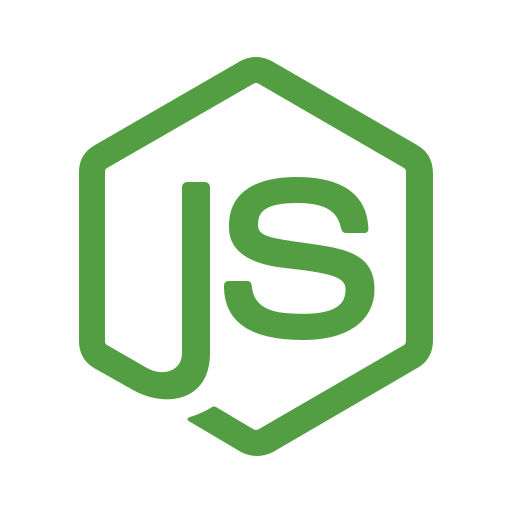
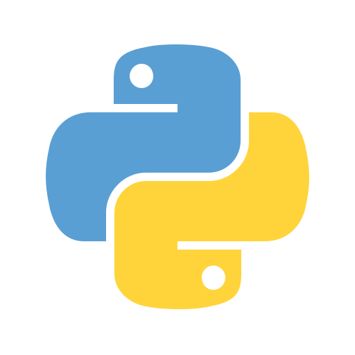

### Hi there, I'm **Nansen Ho**.👋

I'm working in Tokyo as a full stack developer now.

- :seedling: I'm currently learning English and working on algorithm problems.
- :hearts: I like eating :fish:, going :biking_man:, playing :ping_pong: and :badminton:, cooking and taking photos.
- :earth_americas: I speak Chinese (native language) and Japanese (N1 level).

---

#### languages

<code></code>
<code></code>
<code></code>
<code></code>
<code></code>
<code></code>
<code></code>

#### frameworks

<code></code>
<code></code>
<code></code>

#### tools

<code></code>
<code></code>
<code></code>
<code></code>

#### interested

<code></code>
<code></code>

> Additionally, I have created a script to automatically generate the list, and you can find the details in the [NansenHo/NansenHo](https://github.com/NansenHo/NansenHo).

---

You can find how to contact me in the sidebar. You can follow me to find something more interesting.
